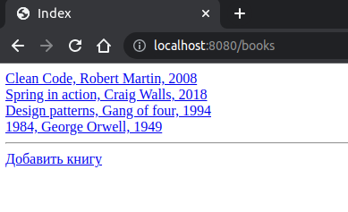
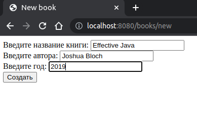
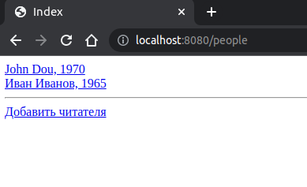
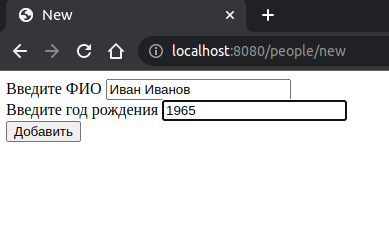
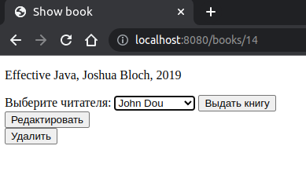
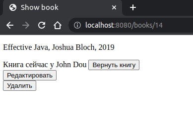
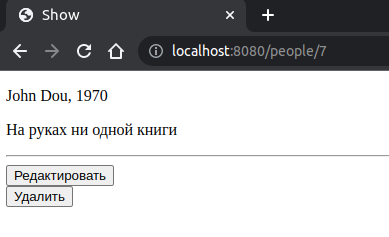
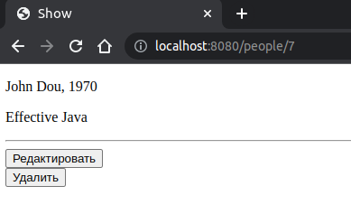

# Проект 1
## Описание

Веб-приложение для цифрового учёта книг. Приложение позволяет регистрировать читателей, выдавать им книги, производить 
возврат книг.

## Используемый стек

- Spring Core
- Spring MVC
- Spring JDBC
- Thymeleaf

Для валидации используется Hibernate Validator и Spring Validator.

[Схема БД](src/main/resources/project1-db.sql)

## Скриншоты страниц приложения
Страница со списком книг

Страница добавления книги

Страница со списком читателей

Страница добавления читателя

Страница книги

Страница читателя

