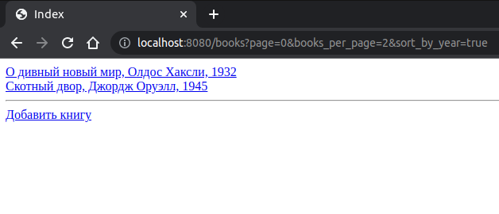
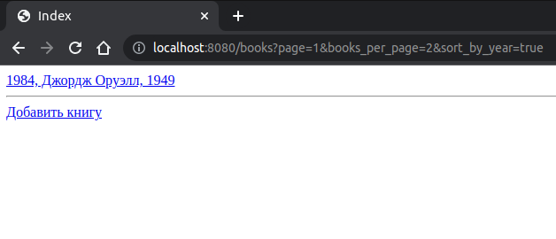
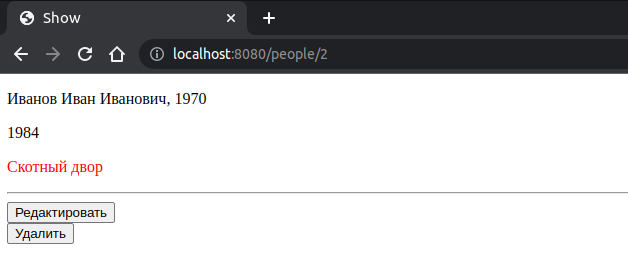
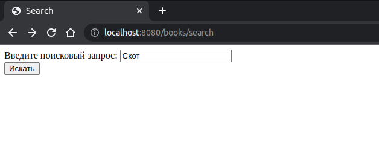
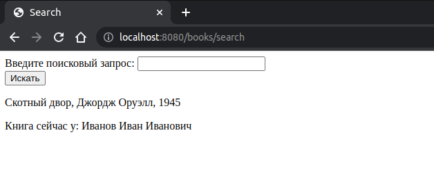

# Проект 2
## Описание

Веб-приложение для цифрового учёта книг. Приложение является модифицированной версией первого проекта с 
использованием концепции ORM. Добавлена проверка просрочки книг, а также поиск по названию книги.

## Используемый стек

- Spring Core
- Spring MVC
- Spring Data JPA
- Thymeleaf

Для валидации используется Hibernate Validator и Spring Validator.

[Схема БД](src/main/resources/project2-db.sql)

## Скриншоты страниц приложения
Страница со списком книг с возможностью постраничного просмотра и сортировкой по году публикации

Страница читателя (красным цветом выделяются просроченные книги)

Страница поиска

