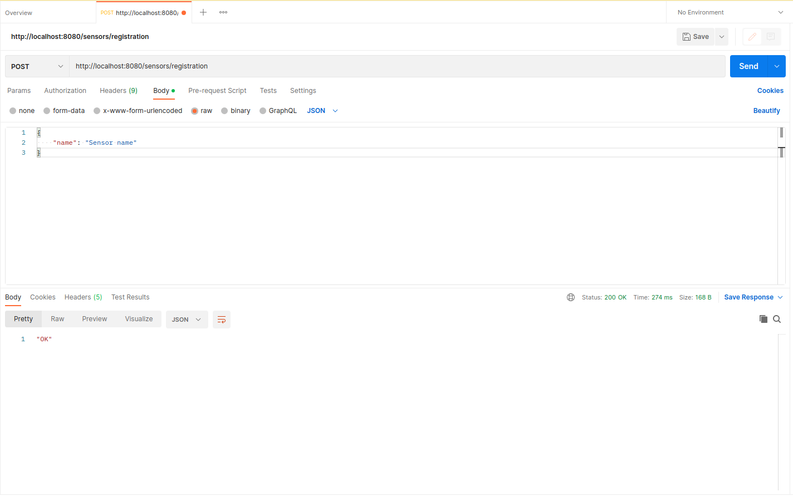
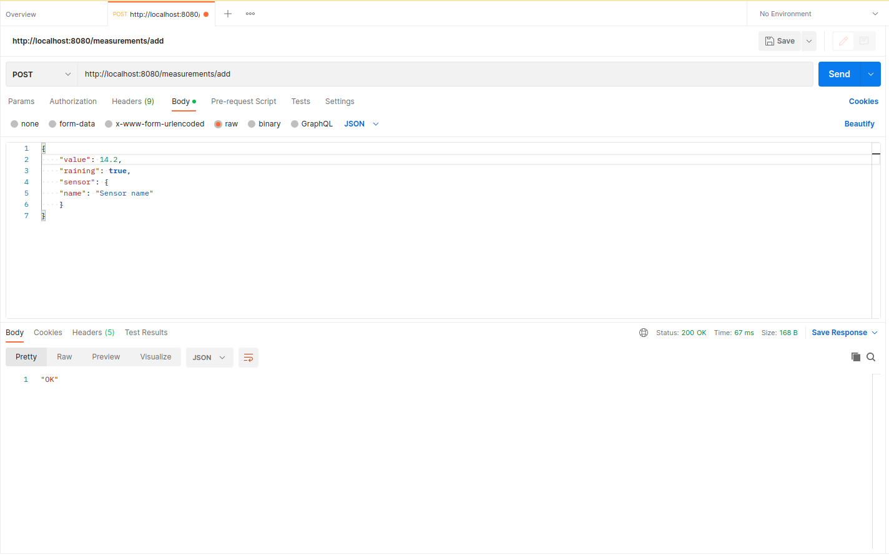
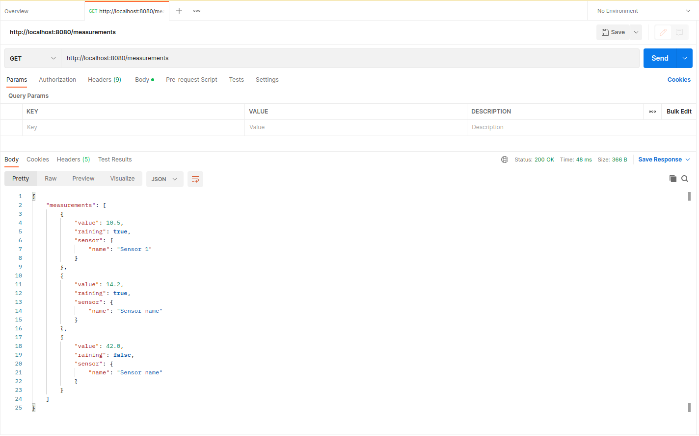

# Проект 3
## Описание

REST API сервис, принимающий данные от метеорологического датчика. В отличии от предыдущих проектов в данном 
используется Spring Boot для автоконфигурации, а также для возможности использования библиотеки Jackson.

[Схема БД](src/main/resources/project3-db.sql)

## Примеры запросов
Регистрация нового сенсора

Добавление нового измерения

Получение списка измерений

Счётчик измерений, в момент которых шёл дождь
")
